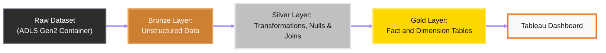

# Flight Analytics Data Lakehouse


A production-style Azure Data Lakehouse that transforms **30 million flight records** into trusted, analytics-ready data for business intelligence and operational reporting.

The pipeline implements a **Medallion Architecture (Bronze → Silver → Gold)** using Azure Data Lake Storage Gen2, Azure Synapse Analytics (SQL Server), Azure Databricks (PySpark) to transform raw aviation data into analytics-ready fact and dimension models for KPI reporting and dashboarding.

This project covers the entire data workflow: **Data Engineering, Data Analysis and Data Visualization.**

### Key Metrics

| Metric | Value |
|---------|---------|
| Records Processed | 30,000,000+ |
| Dataset Columns | 119 |
| Architecture | Medallion (Bronze → Silver → Gold) |
| Cloud Platform | Microsoft Azure |
| Processing Engine | Synapse Analytics + Databricks |
| Visualization Layer | Tableau |

## Table of Contents

- [Features](#features)
- [Why?](#why)
- [Architecture](#architecture)
  - [Diagram](#architecture-diagram)
  - [Workflow](#workflow)
- [Business Questions](#business-questions)
  - [KPIs](#kpis)
  - [KPI Definitions / Formulas](#kpi-definitions-/-formulas)
- [Dataset](#dataset)
- [Azure Setup](#current-azure-setup)
- [Medallion Architecture](#medallion-architecture)
  - [Bronze](#bronze)
  - [Silver](#silver)
  - [Gold](#gold)
- [Repository Structure](#repository-structure)
- [Project Status](#project-status)

## Features

- Implements a Medallion Architecture (Bronze → Silver → Gold) on Microsoft Azure.
- Processes 30M+ flight records and 119 attributes from the U.S. Department of Transportation dataset [(link)](https://www.kaggle.com/datasets/robikscube/flight-delay-dataset-20182022?select=readme.md).
- Builds a cloud-native ETL / ELT pipeline using Azure Data Lake Storage Gen2, Synapse Analytics, and Databricks.
- Transforms raw aviation data into analytics-ready datasets through cleansing, standardization, and enrichment.
- Designs fact and dimension tables optimized for reporting and KPI analysis.
- Delivers interactive Tableau dashboards for operational and business intelligence insights.
- Explores airline performance, airport reliability, route analysis, delays, and cancellations at scale.

## Why?

Most flight delay / prediction projects focus solely on dashboard creation or exploratory analysis. This project was built to go *beyond* visualization and replicate a production-style data engineering workflow on Microsoft Azure.

The primary objectives were:

1. Design and implement an **end-to-end cloud ETL pipeline** using Azure.
2. Gain hands-on experience with Azure Data Lake Storage Gen2, Azure Synapse Analytics, and Azure Databricks.
3. Apply the **Medallion Architecture** (Bronze → Silver → Gold) for scalable data processing.
4. Transform raw aviation data into operational and analytics-ready data using industry-standard data engineering practices.
5. Build a reporting layer capable of supporting business intelligence and operational decision-making.

The goal is to learn and demonstrate both sides of the workflow: reliable data engineering in Azure and practical data analysis / visualization of business KPIs in Tableau.

## Architecture

This section shows the planned cloud architecture and workflow for the Flight Analytics Data Lakehouse project. The pipeline is built fully on Microsoft Azure, with Azure Data Lake Storage Gen2 as the *storage* layer, Azure Synapse Analytics / Azure Databricks as the *transformation* layer, and Tableau as the *reporting* layer.

```mermaid
flowchart LR

    %% =====================
    %% SOURCE LAYER
    %% =====================

    subgraph SOURCE["Data Source"]
        K["Flight Status Prediction (Dataset) <br/>30M+ Rows, 119 Columns"]
    end

    %% =====================
    %% INGESTION
    %% =====================

    subgraph INGEST["Ingestion Layer"]
        DL["File Extract <br/>Parquet + CSV"]
    end

    %% =====================
    %% STORAGE
    %% =====================

    subgraph STORAGE["Azure Data Lake Storage (ADLS) Gen2 "]
        B["Bronze Layer<br/>Raw Data Extract"]
        S["Silver Layer<br/>Cleaned, Transformed & Standardized Data"]
        G["Gold Layer<br/>Analytics-Ready Data with KPI columns, Fact and Dimension Tables, <br> Star / Snowflake Schema"]
    end

    %% =====================
    %% PROCESSING
    %% =====================

    subgraph PROCESS["Data Processing & Transformation (ETL Pipeline)"]
        P1["Azure Synapse Analytics<br/>Bronze → Silver"]
        P2["Azure Databricks (PySpark)<br/>Data Cleansing & Validation"]
        P3["Azure Synapse Analytics<br/>Silver → Gold"]
    end

    %% =====================
    %% DATA MODEL
    %% =====================

    subgraph MODEL["Dimensional Model"]
        F1["fact_flights"]
        D1["dim_airline"]
        D2["dim_airport"]
        D3["dim_route"]
        D4["dim_date"]
    end

    %% =====================
    %% ANALYTICS
    %% =====================

    subgraph BI["Business Intelligence"]
        T["Tableau Dashboard"]
    end

    %% =====================
    %% FLOW
    %% =====================

    K --> DL

    DL --> B

    B --> P1
    P1 --> P2
    P2 --> S

    S --> P3
    P3 --> G

    G --> F1
    G --> D1
    G --> D2
    G --> D3
    G --> D4

    F1 --> T
    D1 --> T
    D2 --> T
    D3 --> T
    D4 --> T

    %% =====================
    %% STYLING
    %% =====================

    style K fill:#374151,stroke:#6B7280,color:#FFFFFF
    style DL fill:#374151,stroke:#6B7280,color:#FFFFFF

    style B fill:#CD7F32,stroke:#E6A15C,color:#FFFFFF,stroke-width:3px

    style S fill:#C0C0C0,stroke:#E5E7EB,color:#111111,stroke-width:3px

    style G fill:#FFD700,stroke:#FFE55C,color:#111111,stroke-width:3px

    style P1 fill:#7C3AED,stroke:#A78BFA,color:#FFFFFF,stroke-width:3px
    style P2 fill:#7C3AED,stroke:#A78BFA,color:#FFFFFF,stroke-width:3px
    style P3 fill:#7C3AED,stroke:#A78BFA,color:#FFFFFF,stroke-width:3px

    style T fill:#F8FAFC,stroke:#E97627,color:#111111,stroke-width:3px

    linkStyle default stroke:#A78BFA,stroke-width:2px
```

<br>

<h3 align="center">Architecture Diagram</h3>


<br>

<br>

---

### WorkFlow

The repository implements the following process for building the ETL / ELT pipeline, and the Dashboard afterwards:
1. Ingest **raw flight files** into Azure Data Lake Storage Gen2 (ADLS Gen2).
2. Store source data in a **Bronze** layer without changing its original structure.
3. Use Azure Synapse Analytics / Azure Databricks to clean, standardize, and transform Bronze data into **Silver**.
4. Build **Gold-layer** fact and dimension tables for reporting KPIs.
5. Use the Gold layer as the analytics-ready source for Tableau **visualizations** and **dashboards.**



## Business Questions

With regards to our dataset, [Flight Status Prediction](https://www.kaggle.com/datasets/robikscube/flight-delay-dataset-20182022?select=readme.md), our *reporting* layer is designed to answer the business questions:

* Which airports experience the highest delay rates and operational congestion?
* Which airlines consistently achieve the best on-time performance (OTP)?
* What seasonal patterns exist in delays, cancellations, and traffic volume?
* Which routes demonstrate the lowest operational reliability?
* What factors contribute most to flight delays?
* How does airline performance vary under different traffic conditions?

----

### KPIs

The following *KPIs (Key Performance Indicators)* are used:

| KPI Category        | Metrics                                                                      |
| ------------------- | ---------------------------------------------------------------------------- |
| Flight Operations   | Total Flights, Completed Flights, Cancelled Flights, Diverted Flights        |
| On-Time Performance | OTP %, Average Departure Delay, Average Arrival Delay                        |
| Airline Performance | OTP by Airline, Average Delay by Airline, Cancellation Rate by Airline       |
| Airport Performance | Airport OTP %, Average Airport Delay, Airport Congestion Index               |
| Route Reliability   | Route OTP %, Average Route Delay, Least Reliable Routes                      |
| Delay Attribution   | Carrier Delay, Weather Delay, NAS Delay, Security Delay, Late Aircraft Delay |
| Seasonal Analysis   | Delay Trends by Month, Quarter, Day of Week, and Season                      |

----

### KPI Definitions / Formulas

* **On-Time Performance (OTP)** = (Flights delayed < 15 minutes) / Total completed flights
* **Average Departure Delay** = Average of `DepDelayMinutes`
* **Average Arrival Delay** = Average of `ArrDelayMinutes`
* **Cancellation Rate** = `Cancelled` flights ÷ Total flights
* **Diversion Rate** = `Diverted` flights ÷ Total flights
* **Airport Congestion Index** = Flight volume × Average `Delay`
* **Route Reliability Score** = Route (`Origin` + `Destination` Pair) OTP adjusted for cancellations and diversions


## Dataset

The dataset is sourced from Kaggle: [Flight Status Prediction](https://www.kaggle.com/datasets/robikscube/flight-delay-dataset-20182022). It contains U.S. flight records from 2018 to 2022, including flight dates, airlines, origin and destination airports, scheduled and actual departure times, delay values, cancellations, diversions, route distance, and delay reason fields.

The source dataset is based on the U.S. Department of Transportation On-Time Performance data. For this project, the working files are yearly Parquet files plus an airline lookup table.

| File | Purpose |
| --- | --- |
| `Combined_Flights_2018.parquet` to `Combined_Flights_2022.parquet` | Yearly flight status records used as the main fact source |
| `Airlines.csv` | Airline code and description lookup |

## Current Azure Setup

The cloud environment is built in Microsoft Azure:

| Component | Current Use |
| --- | --- |
| Azure Data Lake Storage Gen2 | Main storage account for the lakehouse |
| Bronze container | Raw source files loaded from Kaggle |
| Silver container | Cleaned and standardized flight data |
| Gold container | Planned curated fact and dimension model for reporting |
| Azure Synapse Analytics | Cloud transformation layer from Bronze to Silver, then Silver to Gold |
| Tableau | Final dashboard and KPI visualization layer |

The Bronze container currently contains the airline lookup file and yearly flight Parquet files for 2018-2022.

## Medallion Architecture

### Bronze

The Bronze layer stores raw source files exactly as received. This layer is used for reproducibility and auditability. No business logic is applied here.

Expected responsibilities:

- Preserve original Kaggle files.
- Store yearly flight Parquet files and lookup data.
- Keep raw data separate from cleaned and modeled data.
- Provide a stable input source for Synapse transformations.

### Silver

The Silver layer contains cleaned, typed, and analysis-ready flight records. This is the current development focus.

Expected transformations:

- Read Bronze Parquet and CSV files from ADLS Gen2.
- Standardize column names and data types.
- Handle nulls, invalid values, and inconsistent time fields.
- Join airline descriptions where needed.
- Keep useful operational fields for delay, cancellation, diversion, airport, airline, route, and time analysis.
- Write cleaned output back to the Silver container.

### Gold

The Gold layer will contain curated tables designed for analytics and dashboard performance. This layer will be modeled around facts and dimensions rather than raw files.

Planned Gold model:

| Table | Purpose |
| --- | --- |
| `fact_flights` | Flight-level metrics such as delay minutes, cancellation flag, diversion flag, distance, and flight count |
| `dim_airline` | Airline code, airline name, and airline-level attributes |
| `dim_airport` | Origin and destination airport details |
| `dim_route` | Origin-destination route combinations |
| `dim_date` | Calendar attributes such as day, month, quarter, year, weekday, and season |

## Working Data Sheet

The project focuses on a practical subset of the full source schema for KPI development.

### Combined Flights

| Column | Description | Type |
| --- | --- | --- |
| `FlightDate` | Flight date | `DATE` |
| `Airline` | Airline carrier | `VARCHAR` |
| `Origin` | Origin airport | `VARCHAR` |
| `Dest` | Destination airport | `VARCHAR` |
| `Cancelled` | Whether the flight was cancelled | `BOOLEAN` |
| `Diverted` | Whether the flight was diverted | `BOOLEAN` |
| `CRSDepTime` | Scheduled departure time | `INTEGER` |
| `DepTime` | Actual departure time | `DECIMAL` |
| `DepDelayMinutes` | Departure delay in minutes, with early departures set to 0 | `DECIMAL` |
| `DepDelay` | Departure delay offset, including early departures | `INTEGER` |

### Airlines

| Column | Description | Type |
| --- | --- | --- |
| `Code` | Airline code | `VARCHAR` |
| `Description` | Airline description | `VARCHAR` |


## Repository Structure

The main README gives the project overview. Separate layer-specific documentation will describe implementation details.

```text
.
+-- README.md
+-- Bronze.md
+-- Silver.md
+-- Gold.md
+-- synapse/
|   +-- bronze_to_silver/
|   +-- silver_to_gold/
+-- sql/
+-- tableau/
+-- docs/
```

## Project Status

| Stage | Status |
| --- | --- |
| Dataset selected | Complete |
| Azure storage account created | Complete |
| Bronze, Silver, and Gold containers created | Complete |
| Bronze files uploaded | Complete |
| Bronze to Silver transformation in Synapse | In progress |
| Gold fact and dimension model | Planned |
| Tableau dashboard | Planned |

## Outcome

The final output will be a cloud-based data lakehouse that transforms raw flight status records into clean, modeled, dashboard-ready data. The Tableau dashboard will focus on operational flight performance, delay behavior, airline reliability, airport congestion, and route-level trends.


